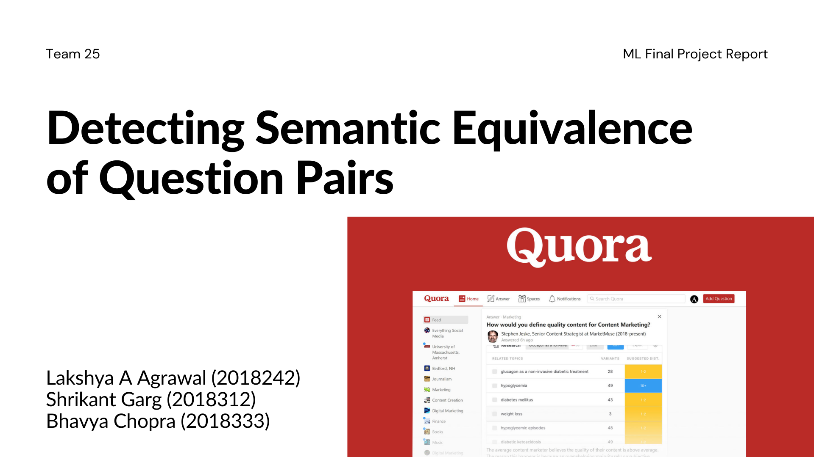
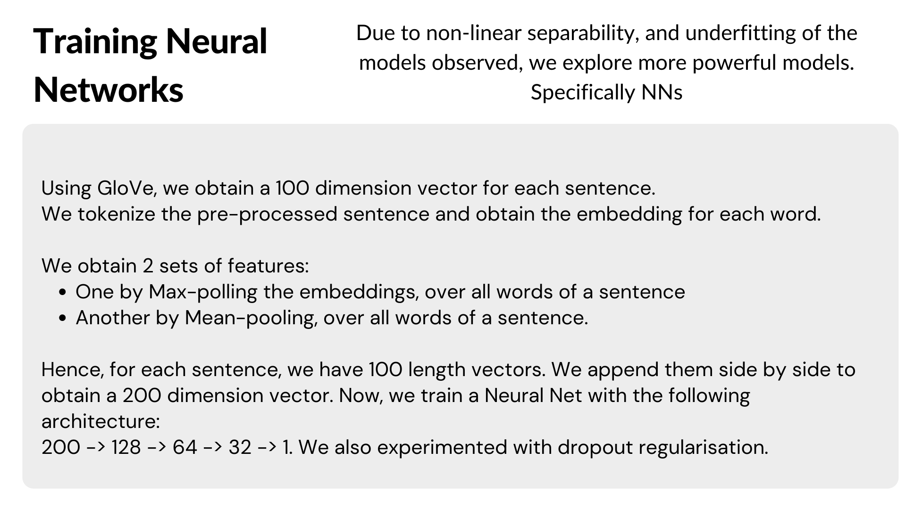
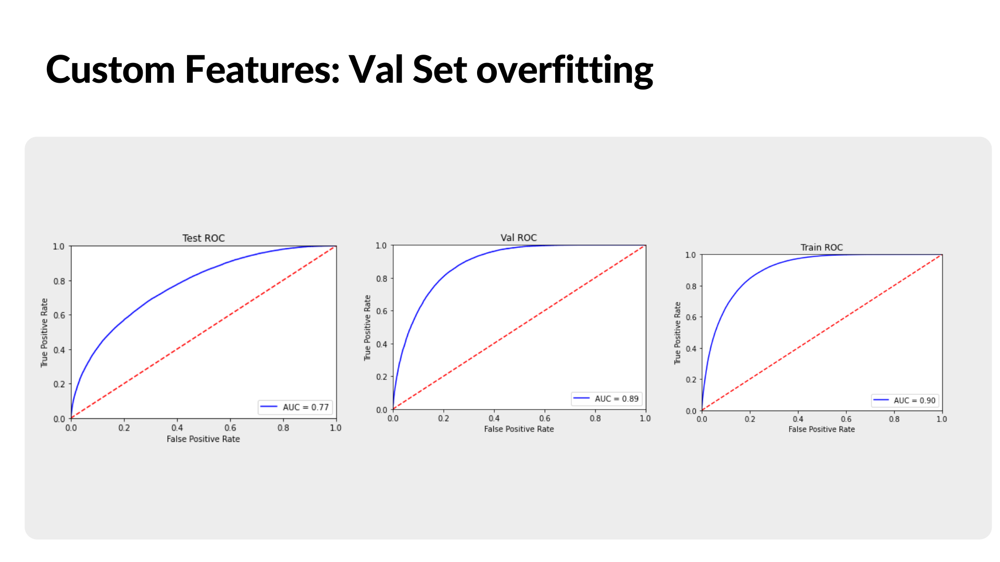

# Detecting Semantic Equivalence of Quora Question Pairs

Lakshya A Agrawal (lakshya18242@iiitd.ac.in)  
Shrikant Garg (shrikant18312@iiitd.ac.in)  
Bhavya Chopra (bhavya18333@iiitd.ac.in)  

Link to dataset: [Kaggle Quora Question Pairs](https://www.kaggle.com/c/quora-question-pairs/data)

### Problem Statement

Popular QnA websites, such as StackExchange, Quora and Yahoo Answers are visited by millions of users on a daily basis, which leads different users to ask separate questions with similar intent. This makes it difficult for users to seek the best answer, and such ‘duplicate’ questions require to be manually moderated to be taken down or merged with similar threads. These repeated questions can result in poor recommendations for the users as well. This motivates us to identify duplicate question pairs on such forums. The learning task is to train a classifier which can predict if a given question pair is semantically equivalent or not with the classes being “equivalent” and “not equivalent”.

### Dataset
The chosen dataset is manually annotated, with a large number of training samples belonging to Quora. The table below shows the training, test and validation set splits. 

| Set            | Samples | Split Ratio |
|----------------|---------|-------------|
| Total Samples  | 404,290 | 1.0         |
| Train Set      | 291,089 | 0.72        |
| Test Set       | 80,858  | 0.2         |
| Validation Set | 42,343  | 0.08        |

The dataset (60 MB) consists of 6 attributes:
 - id: ID for every question pair
 - qid1: Unique ID for first question
 - qid2: Unique ID for second question
 - question1: Text for first question
 - question2: Text for second question
 - is_duplicate: 0 if questions are not duplicates, 1 if questions are duplicates. 

We found the data to be imbalanced (Class_0:Class_1 ratio is 63:37)

</img>

Word cloud for different question pairs:

Word cloud for duplicate question pairs:

### Slides

### Feature Extraction
</img>
</img>

### Feature Selection
Pair Plots for all extracted features:

</img>

### Baseline models

</img>

</img>

### Text to Vector approaches

</img>

</img>

### Training Neural Networks

### Results and Conclusion
  
